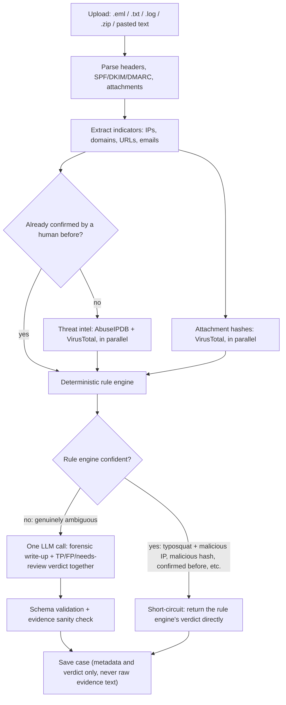

Phishing hasn't slowed down, it's gotten more automated on both sides of
the fight. APWG logged 989,123 phishing attacks in Q4 2024 alone, up from
932,923 the quarter before, with SaaS and webmail logins as the single
most targeted category at 23.3 percent of all attacks[^apwg]. IBM's 2025
Cost of a Data Breach report puts the global average cost of a breach at
$4.44 million, and the mean time to identify and contain one at 241
days, the lowest that figure has been in nine years, but still eight
months of an attacker sitting somewhere they shouldn't be[^ibm]. Email is
still the door most of that comes through.

I built ZER0HS to sit at the point where a suspicious email lands and an
analyst has to decide, fast, whether it's real. It's a self-hosted
phishing and email forensics tool: give it an `.eml` file, pasted text,
or a `.zip` of several, and it extracts every IP, domain, URL, and
attachment hash, checks them against AbuseIPDB and VirusTotal, and
returns a verdict with the actual evidence behind it, not just a score.

<!--more-->

## The decision that shapes everything else

The interesting part of this project isn't the LLM. It's that the LLM
doesn't get the final word.

A deterministic rule engine runs first on every case, and when it's
already confident (a typosquatted domain paired with a malicious IP, an
attachment hash VirusTotal already knows about, an indicator a human
analyst has confirmed before), it returns a verdict directly and the LLM
is never called at all. That's faster, and it closes off an entire class
of problem: a prompt-injection payload sitting in the email body has
nothing to attack, because there's no model in the loop to manipulate on
the cases that were never ambiguous to begin with.

For the cases that are genuinely ambiguous, one LLM call, local through
Ollama by default or Claude if you opt in, produces a forensic write-up
and a verdict together. The evidence text gets wrapped in explicit
delimiters with an instruction to treat anything instruction-like inside
it as a finding to report, not a command to follow, since the email
under analysis is the one input in this entire system an attacker fully
controls.

## A third verdict: needs review

Early on, every case had to resolve to a confident true positive or
false positive, which meant a genuinely ambiguous case still got forced
into one bucket or the other. The clearest failure case was a clean,
legitimate security notification worded almost exactly like a phishing
email: "security alert," "your password expires soon," from a real
domain with nothing malicious attached to it. The model called it a true
positive. Confidently. Wrong.

`NEEDS_REVIEW` exists because of that case. It triggers when the model's
own confidence lands in a genuinely uncertain band, or when the rule
engine and the model disagree on a hard signal, and it comes back with
an explanation of exactly what's conflicting rather than a guess dressed
up as certainty. Running the same false-positive stress test again, one
of the two hard cases now resolves correctly to FP on its own, and the
other lands as needs review with a real explanation instead of a
confident wrong answer. That's the actual goal here, not a higher
accuracy number, fewer confident wrong answers.

## What it maps to

Every true-positive verdict cites the specific evidence behind it and,
where the trigger is clear enough, the matching MITRE ATT&CK[^mitre]
technique.

| Trigger | Technique |
|---|---|
| Typosquat or lookalike domain in a link | T1566.002, Spearphishing Link |
| Malicious attachment confirmed by hash | T1566.001, Spearphishing Attachment |
| Dangerous attachment executed if opened | T1204.002, User Execution: Malicious File |
| High-risk IP behind the sending infrastructure | T1584.005, Compromise Infrastructure: Botnet |

## Does it actually work

`backend/scripts/run_benchmark.py` runs the pipeline against 41 labeled
cases with real AbuseIPDB and VirusTotal lookups and a local qwen2.5:14b
model, and prints a real confusion matrix, not a number I typed in
because it sounded reasonable.

| Metric | Value |
|---|---|
| Cases | 41 (2 flagged needs review, scored separately) |
| Accuracy | 97.4% |
| Precision | 100.0% |
| Recall | 95.0% |
| False positives | 0 |
| False negatives | 1 |
| Total run time | 190.3s (485.8s before merging two LLM calls into one) |

That's a small, synthetic benchmark built for this project, not a claim
about real-world accuracy at scale, so I'm treating it as a reproducible
regression number rather than a marketing figure. The one false negative
is a business-email-compromise case with no bad domain and no bad IP,
nothing but wording and a Reply-To mismatch to go on, which is exactly
the category where a 14B local model has the least to work with.

## Two bugs worth writing down

Neither of these is dramatic, but they're the kind of bug that only
shows up once real, messy input hits the system, which is most of what
building this actually looked like.

**A URL wrapped in parentheses broke the scan.** An email that mentioned
a link like `(http://www.instagram.com/capitalone/)`, closing paren and
all, got extracted with the paren still attached, since the regex
pulling URLs out of raw text had no concept of "this closing bracket
belongs to the sentence, not the link." The fix walks back from the end
of a matched URL, stripping trailing punctuation and any closing bracket
that doesn't have a matching opener earlier in the string, so a URL that
legitimately ends in a balanced parenthesis (a Wikipedia-style link, for
instance) is left alone while prose brackets get stripped.

**The most confident verdicts had the emptiest reports.** When the rule
engine short-circuits, it skips the LLM, which also meant it skipped
populating the IOC and MITRE ATT&CK fields in the report, because that
function had `"mitre_techniques": []` and `"iocs": []` hardcoded in it
regardless of what actually triggered the verdict. The cases the rule
engine is most confident about are exactly the cases with the most
concrete evidence sitting right there, a typosquat domain, a scored IP,
a flagged hash, so the fix pulls those real values into the report
instead of returning nothing for the reports that should have had the
most in them.

## Running it yourself

It's local-first by default. Point it at Ollama and the email content
you're analyzing never has to leave your machine; point it at Claude
instead if you want to, but that's an opt-in, not the default. The
[repository](https://github.com/ZER0HS/zer0hs-ai-forensic) has the full
setup, a Docker Compose path if you want the fastest route in, and three
synthetic sample emails so you can see a full case run without writing
your own test file first.

If you find a real bug in it, `SECURITY.md` in the repo has the right
way to report it.

---

[^apwg]: [APWG Phishing Activity Trends Report, 4th Quarter 2024](https://docs.apwg.org/reports/apwg_trends_report_q4_2024.pdf)
[^ibm]: [IBM, 2025 Cost of a Data Breach: Navigating AI](https://www.ibm.com/think/x-force/2025-cost-of-a-data-breach-navigating-ai)
[^mitre]: [MITRE ATT&CK, T1566: Phishing](https://attack.mitre.org/techniques/T1566/)
